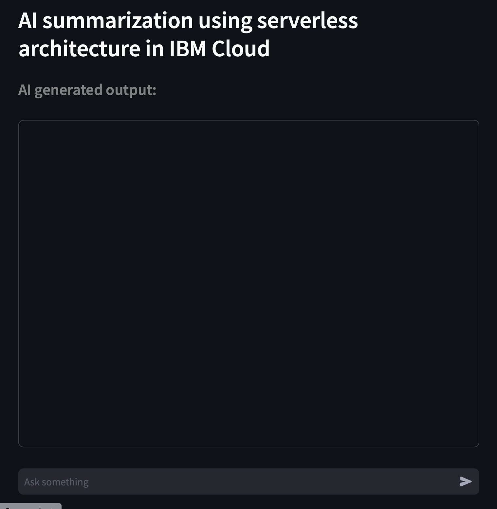

# ai-summ-codeengine-app

## Overview

The objective of the "AI summarization using highly resilient serverless architecture" pattern is to provide users a high-level overview of solution design and components used in hosting a highly resilient serverless web application in IBM Cloud.

The example web application uses streamlit python module for the UI, and ‘IBM-watsonx-ai’ library for inferencing by using one of IBM foundation model available in IBM Cloud watsonx.ai platform.

Detailed documentation can be found here: [AI summarization using highly resilient serverless architecture](
https://cloud.ibm.com/docs/pattern-code-engine-ai-summary-app)

## Application UI

